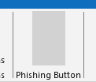
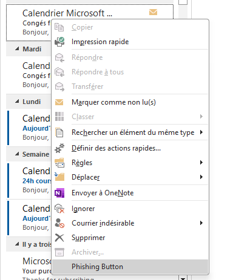
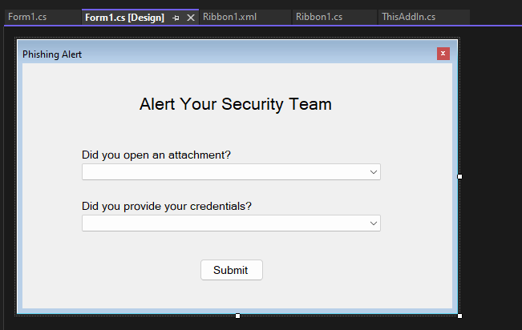
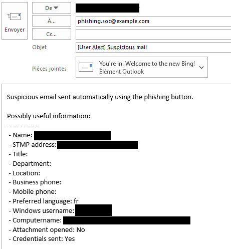

# Phishing Button


## Introduction/Context

The goal of this repo is to create an Outlook Add-In which will be useful to report phishing emails from the Outlook client.

Note: this project was inspired by https://github.com/certsocietegenerale/NotifySecurity.


## Caveat

- You need to be a little bit familiar with Visual Studio to follow through on this article.
- This doesn't work on web and mobile.
- It's possible to make an add-in which will work everywhere and upload the phishing email to a sharepoint by using `office.js` and an azure app. However, it is a bit more complicated to create the development environment.


## Build the Outlook extension

Create the button to notify the security team:

1. Create a new Outlook Project using the `Outlook VSTO Add-in` template.
2. Add a new element to the project, select the `Ribbon (XML)` template.
3. Change the newly created file `Ribbon1.xml` to display a button:
    ```xml
    <?xml version="1.0" encoding="UTF-8"?>
    <customUI xmlns="http://schemas.microsoft.com/office/2009/07/customui" onLoad="Ribbon_Load">
      <ribbon>
        <tabs>
          <tab idMso="TabMail" visible="true">     <!-- "TabMail" is the default tab when you open Outlook -->
            <group id="MyGroup" label="Phishing Button" visible="true">
    		  <button id="MyTabButton" size="large" onAction="PhishingButtonClicked"></button>
            </group>
          </tab>
        </tabs>
      </ribbon>
    
      <contextMenus>
        <contextMenu idMso="ContextMenuMailItem">  <!-- "ContextMenuMailItem" is the menu when you right-click on an email -->
          <button id="MyContextMenuButton" label="Phishing Button" onAction="PhishingButtonClicked"/>
        </contextMenu>
      </contextMenus>
    </customUI>
    ```
4. Change the file `ThisAddIn.cs` to create the ribbon on startup:
    ```cs
    private void ThisAddIn_Startup(object sender, System.EventArgs e)
    {
        CreateRibbonExtensibilityObject();
    }

    protected override Microsoft.Office.Core.IRibbonExtensibility CreateRibbonExtensibilityObject()
    {
        return new Ribbon1();
    }
    ```

The result should look like this:



Ask the user if he gave his credentials or if he opened an attachment (this will enable us to launch the appropriate response after the analysis of the email and its attachments):

1. Add a new element to the project, select the `Form (Windows Form)` template.
2. Add the necessary buttons and labels to the form:
    
3. Add the necessary event handlers in order to enable the **submit** button only when the questions have been answered (file `Form1.cs`):
    ```cs
    public bool formSubmitted = false;

    // check if both questions have been answered before enabling the "Submit" button
    private void EnableButton1()
    {
        if (this.comboBox1.Text != "" && this.comboBox2.Text != "")
        {
            this.button1.Enabled = true;
        }
    }

    // when the user answers a question, the program will check if it should enable the "Submit" button
    private void comboBox1_SelectedIndexChanged(object sender, EventArgs e)
    {
        this.EnableButton1();
    }
    private void comboBox2_SelectedIndexChanged(object sender, EventArgs e)
    {
        this.EnableButton1();
    }

    // close the form and change the value of the public member "formSubmitted" which show the form wasn't cancelled
    private void button1_Click(object sender, EventArgs e)
    {
        this.formSubmitted = true;
        this.Close();
    }

    // simple functions to get the answers of the user
    public bool AttachmentOpened()
    {
        bool result = this.comboBox1.Text == "Yes";
        return result;
    }
    public bool CredentialsProvided()
    {
        bool result = this.comboBox2.Text == "Yes";
        return result;
    }
    ```
4. Create the function which will open the form when the phishing button is clicked `PhishingButtonClicked` in the file `Ribbon1.cs`:
    ```cs
    public void PhishingButtonClicked(Office.IRibbonControl control)
    {
        var formPopup = new Form1();
        formPopup.ShowDialog();

        bool attachment_opened = formPopup.AttachmentOpened();
        bool credential_send = formPopup.CredentialsProvided();

        // check if the user submitted the form or cancelled it
        if (formPopup.formSubmitted)
        {
            CreateNewMailToSecurityTeam(control, attachment_opened, credential_send);
        }
    }
    ```

Get the information on the email the user reported and send it to a specific email address:

1. Get information from the user (file `Ribbon1.cs`):
    ```cs
    public String GetCurrentUserInfos()
    {
        String wComputername = System.Environment.MachineName + " (" + System.Environment.OSVersion.ToString() + ")";
        String wUsername = System.Environment.UserDomainName + "\\" + System.Environment.UserName;

        Outlook.ExchangeUser currentUser = Globals.ThisAddIn.Application.Session.CurrentUser.AddressEntry.GetExchangeUser();

        string str = "Possibly useful information:\n--------------";

        str += "\n - Name: " + currentUser.Name;
        str += "\n - STMP address: " + currentUser.PrimarySmtpAddress;
        str += "\n - Title: " + currentUser.JobTitle;
        str += "\n - Department: " + currentUser.Department;
        str += "\n - Location: " + currentUser.OfficeLocation;
        str += "\n - Business phone: " + currentUser.BusinessTelephoneNumber;
        str += "\n - Mobile phone: " + currentUser.MobileTelephoneNumber;
        str += "\n - Preferred language: " + CultureInfo.CurrentCulture.TwoLetterISOLanguageName;
        str += "\n - Windows username: " + wUsername;
        str += "\n - Computername: " + wComputername;
        str += "\n";

        return str;
    }
    ```
2. Create the email with all the necessary information and display it (or send it):
    ```cs
    private void CreateNewMailToSecurityTeam(IRibbonControl control, bool attachment_opened, bool credentials_sent)
        {
            Selection selection = Globals.ThisAddIn.Application.ActiveExplorer().Selection;

            // check if the user actually selected an email
            if (selection.Count < 1)
            {
                MessageBox.Show("Please select one email.");
                return;
            }
            else if (selection.Count > 1)
            {
                MessageBox.Show("Please select only one email.");
                return;
            }
            object mailItem = selection[1]; // index starts at 1

            // generate a new email to send to the security team
            MailItem tosend = (MailItem)Globals.ThisAddIn.Application.CreateItem(Outlook.OlItemType.olMailItem);
            tosend.Attachments.Add(mailItem);
            tosend.Subject = "[User Alert] Suspicious mail";
            tosend.To = "phishing.soc@example.com";

            tosend.Body = "Suspicious email sent automatically using the phishing button.\n\n";
            tosend.Body += GetCurrentUserInfos();
            tosend.Body += " - Attachment opened: " + (attachment_opened ? "Yes" : "No");
            tosend.Body += " - Credentials sent: " + (credentials_sent ? "Yes" : "No");

            tosend.Display();
        }
        ```

Here is the end result:



## Conclusion

It's quite easy to build an Outlook add-in to report phishing emails to a security team. The only things left are to change the messages, the questions and add an icon to make the add-in more user friendly.


